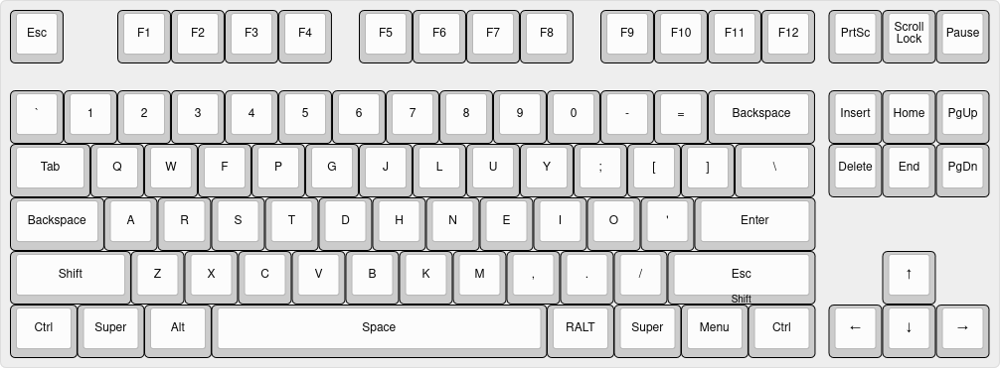
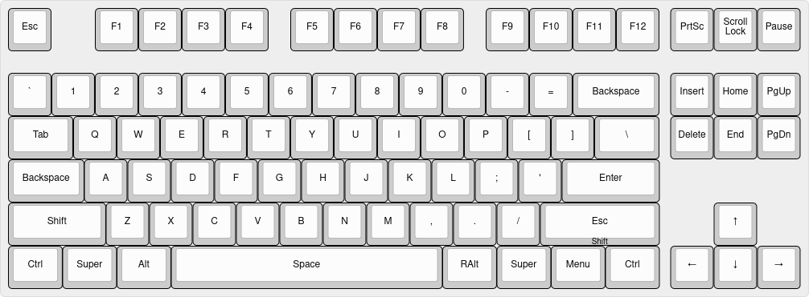
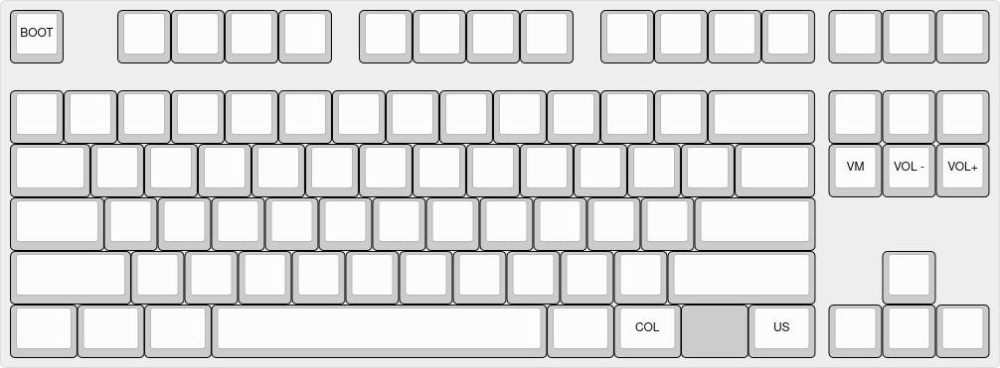
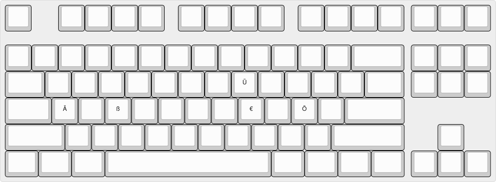

# Custom keymap

My keymap consists of three layers:
- Colemak
- QWERTY
- Fn
- RALT

The RALT layer exists in order to have special characters (Umlaute, ß, €)
above the same location as their regular counterparts.

### Notation
- The top legend shows the tapping action.
- The bottom legend shows the hold action.

### Colemak layer

### QWERTY layer

### Fn layer

### RALT layer

