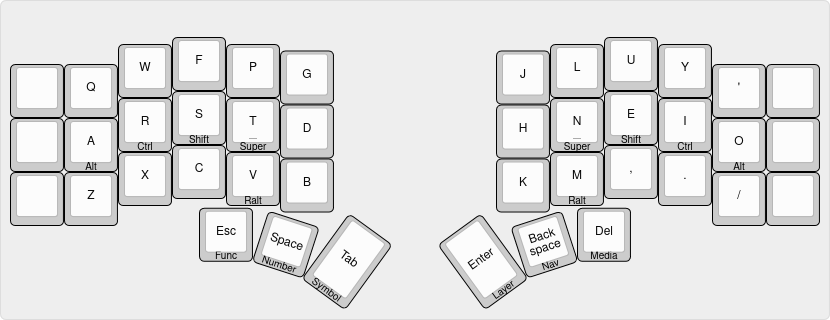
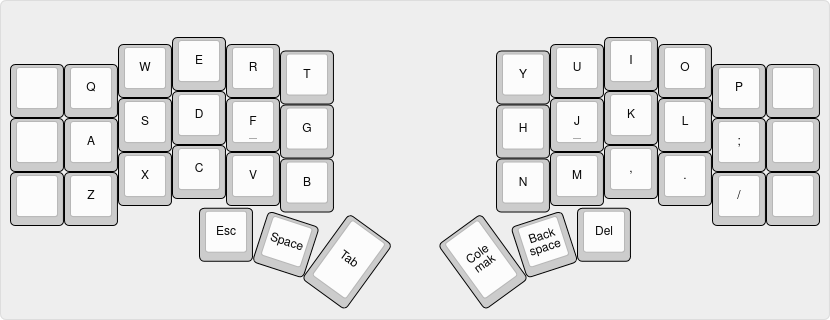
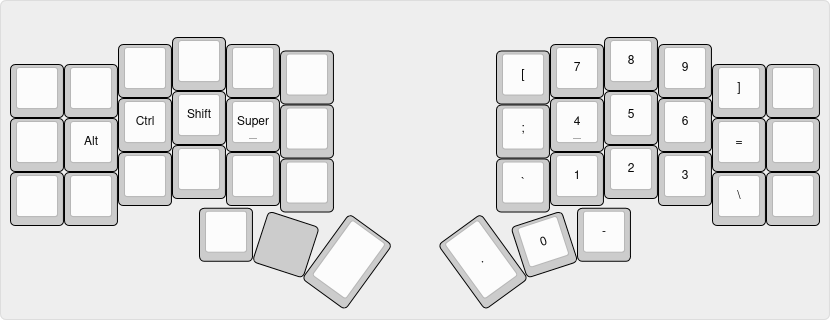
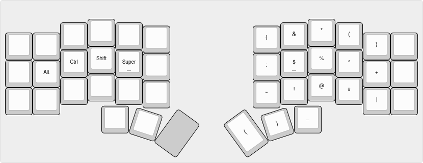
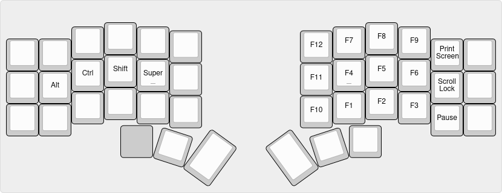
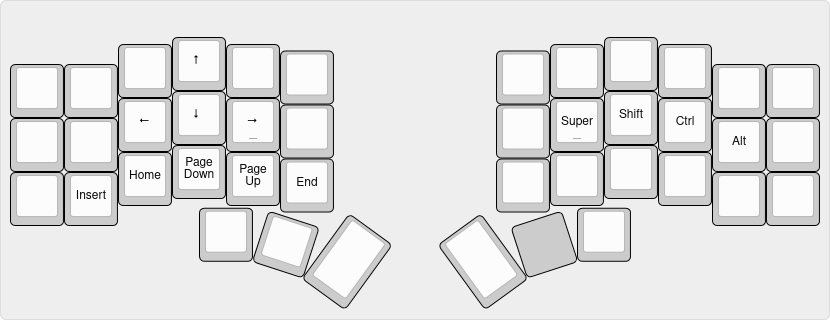
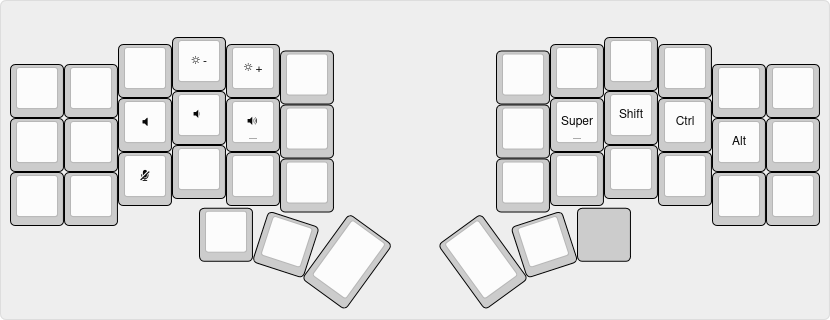
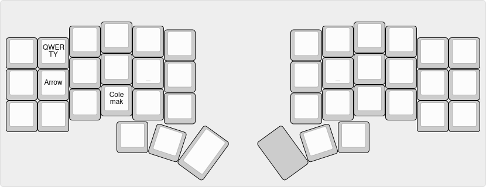
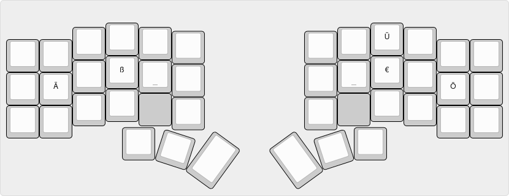
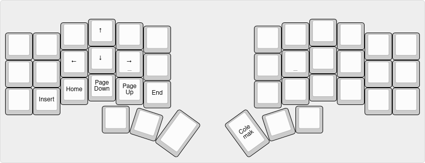

# Custom keymap.

My custom keymap which is heavily inspired by [Miryoku](https://github.com/manna-harbour/miryoku).
Some differences are:

- Number, Symbol, and Function layer are right-hand layers
- arrows are above `WASD`
- modifier order is `Alt`, `Ctrl`, `Shift`, `Super`

## Features

- [Miryoku](https://github.com/manna-harbour/miryoku) based
- [home row mods](https://precondition.github.io/home-row-mods)
- [mod-tap](https://docs.qmk.fm/#/mod_tap)
- [caps word](https://docs.qmk.fm/#/feature_caps_word)
- multiple layers with Colemak as base
- RALT layer for Umlaute, ß, €
- Gaming layer

## LAYERS

### Colemak

Base layer is Colemak with homerow mods.
`'` replaces `;` at the top right.
As I use a [tiling Wayland Compositor](https://hyprland.org),
my most used modifiers (`Shift`, `Super`) are on my strongest fingers.
`Ralt` is below the home row to be able to hold `hjkl` in vim.

### QWERTY

Basic QWERTY layout. Pressing the `Colemak` key returns to the Colemak layer.

### Number

Numbers are arranged like a numpad with symbols in the remaining positions.

### Symbol

Symbols are in the same location as shifted numbers.

### Function

`F1` to `F9` are arranged as the number layer with `F10` to `F12` to the left and system keys on the right.

### Navigation

Arrow keys at the same location as `WASD` with navigation keys below.

### Media

This layer includes brightness and volume control.
The `micmute` key sends `Super` + `/` which is configured to toggle the microphone
in my Wayland Compositor.

### Layer

Switch default layer to the selected.
Locations are mnemonic:

- `A` for `Arrow`
- `C` for `Colemak`
- `Q` for `QWERTY`

### Ralt

Custom Right-Alt layer for german letters and €-Symbol. Assumes US-International keyboard.

### Arrow

Dedicated arrow layer above `WASD`.

